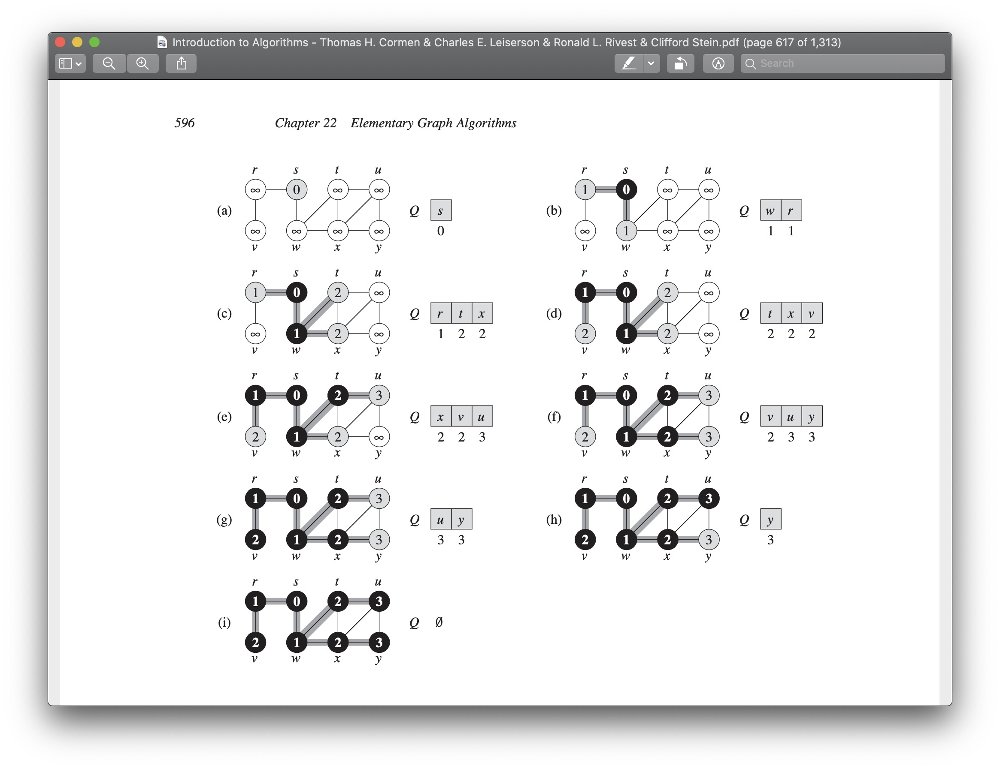
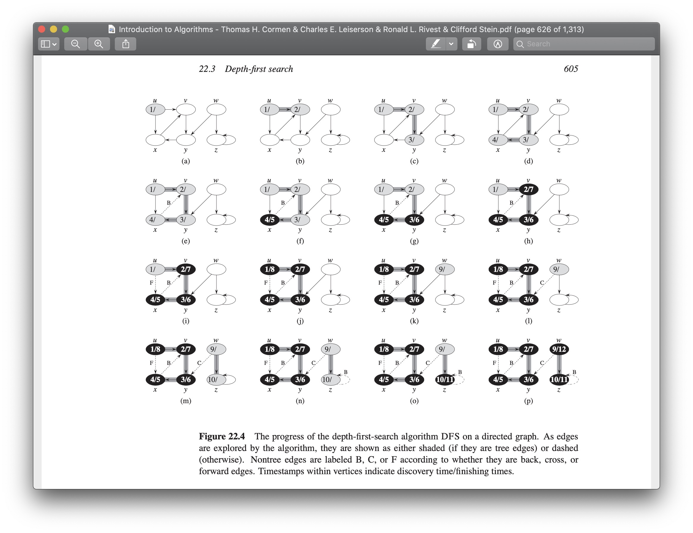
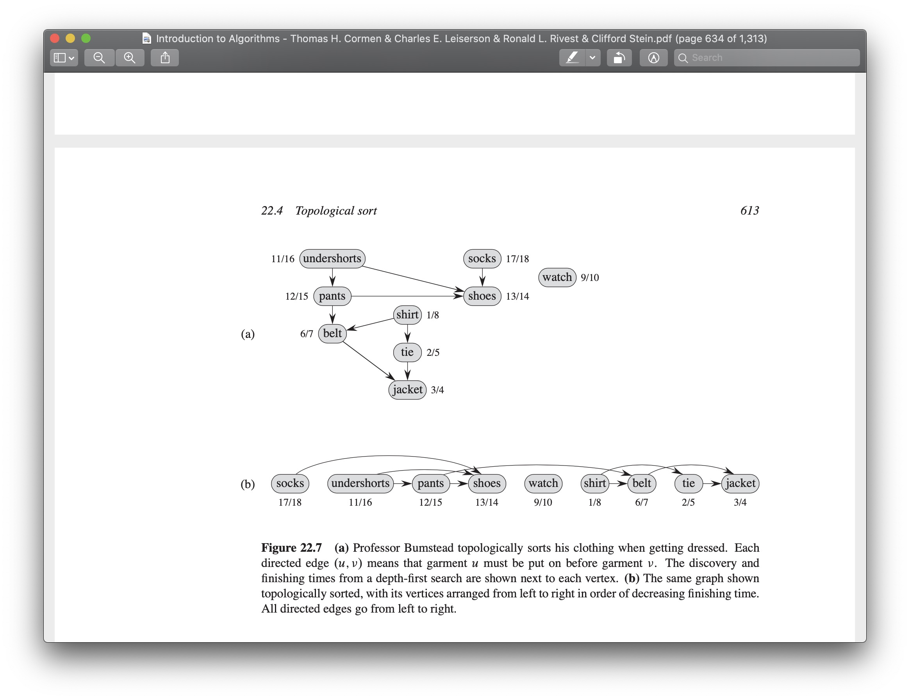
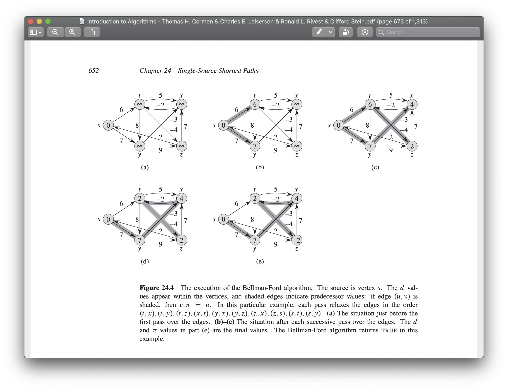
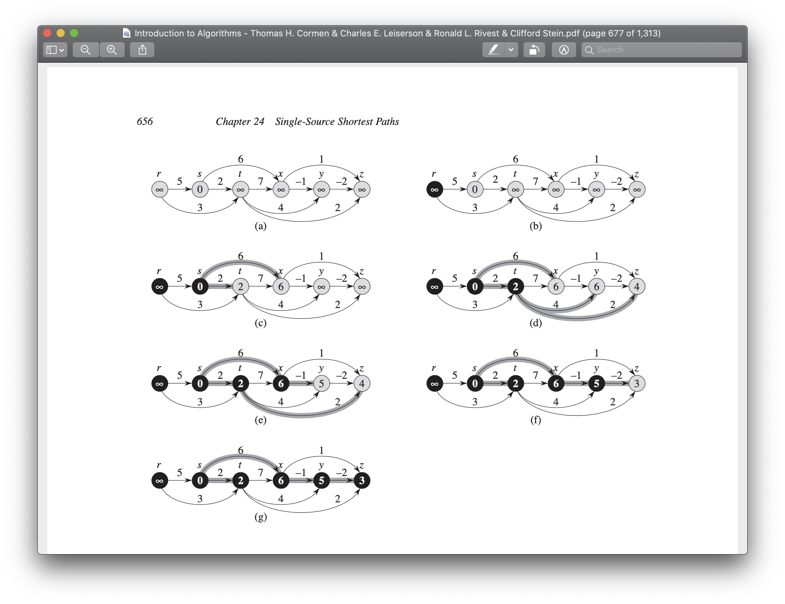
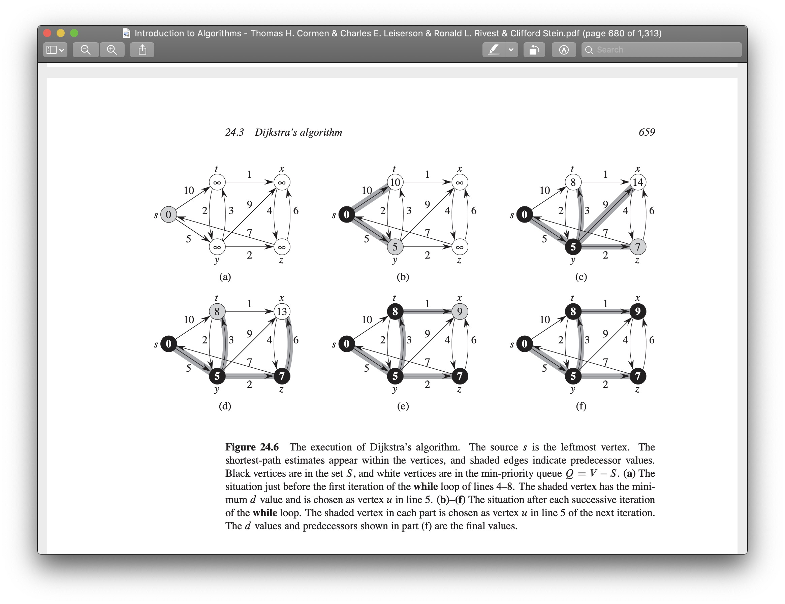

# About

TypeScript Implementation for some Graph Algorithms introduced in this book:

- [Introduction to Algorithms](https://en.wikipedia.org/wiki/Introduction_to_Algorithms)

# Algorithms

- [BFS](#bfs)
- [DFS](#dfs)
- [Topological Sort](#topological-sort)
- [Bellman-Ford Algorithm](#bellman-ford-algorithm)
- [DAG Shortest Paths](#dag-shortest-paths)
- [Dijkstra’s Algorithm](#dijkstras-algorithm)

## BFS

Sample:

```bash
ts-node sample/bfs.ts
```



## DFS

Sample:

```bash
ts-node sample/dfs.ts
```



## Topological Sort

Sample:

```bash
ts-node sample/topological-sort.ts
```



## Bellman-Ford Algorithm

Sample:

```bash
ts-node sample/bellman-ford.ts
```



## DAG Shortest Paths

Sample:

```bash
ts-node sample/dag-shortest.ts
```



## Dijkstra’s Algorithm

Sample:

```bash
ts-node sample/dijkstra.ts
```


